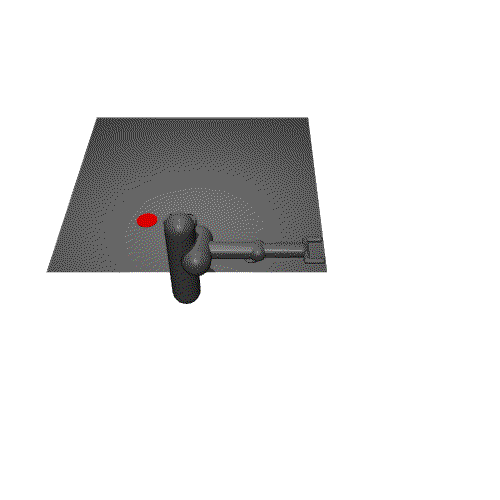
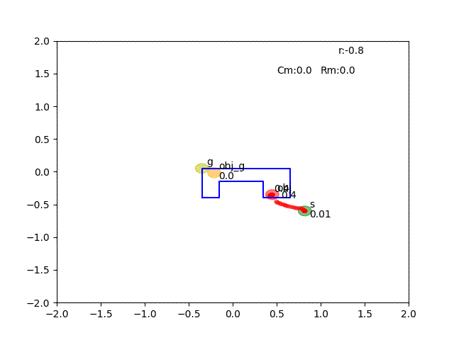
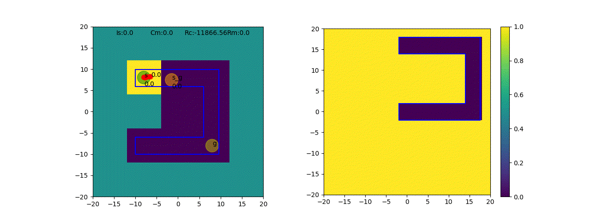
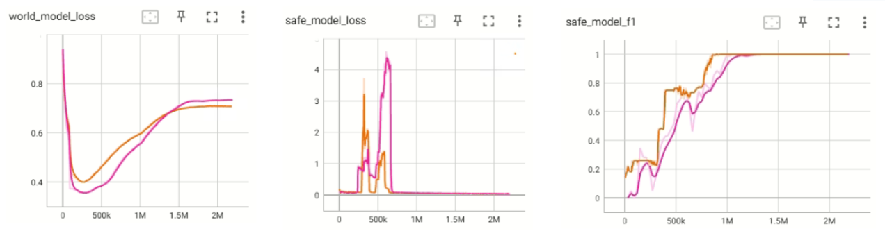
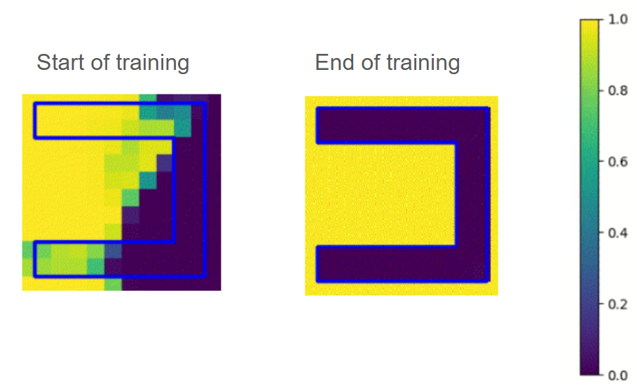
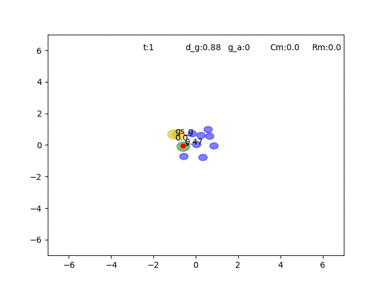
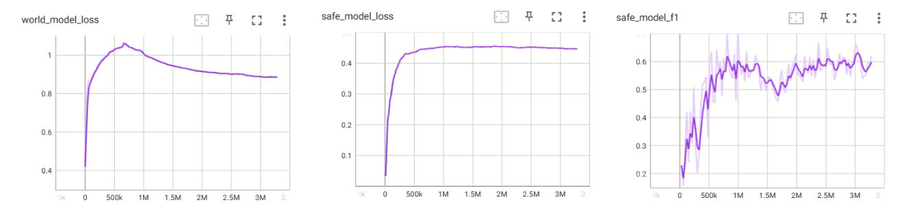

# Pusher Environment
Pusher environment featuring a 7-DoF robotic arm tasked with maneuvering an object to a target within a safe zone.
- The blue area = safe zone
- Green circle = end-effector
- Orange cirlce = generated subgoal
- Yellow circle = goal
- Red trajectories = end effector, object trajectories in World Model

  
   

# Ant Maze C shape Environment
- The blue area = safe zone
- Green circle = end-effector
- Orange cirlce = generated subgoal
- Yellow circle = goal
- Red trajectories = robot traectory in World Model

# Cost Model, World model logging info(AntMazeCshape)
- world_model_loss = MSE Loss of World Model
- safe_model_loss = Cross Entropy Loss of Cost Model
- safe_model_f1 = f1 score of Cost Model on dataset with 30_000 samples

# Cost Model HeatMaps(AntMazeCshape)
- The right panel illustrates the Cost Model's state 
danger assessments, where values range from 0 (safe) to 1 (hazardous). 
- The blue contour demarcates the safety boundary.

## Cost Model, World model logging info(AntMazeCshape)
- world_model_loss = MSE Loss of World Model
- safe_model_loss = Cross Entropy Loss of Cost Model
- safe_model_f1 = f1 score of Cost Model on dataset with 30_000 samples

## Cost Model HeatMaps(AntMazeCshape)
- The right panel illustrates the Cost Model's state 
danger assessments, where values range from 0 (safe) to 1 (hazardous). 
- The blue contour demarcates the safety boundary.

# Safety Gym Point Goal1 Environment
- The blue circles = hazard zones
- Green circle = end-effector
- Orange cirlce = generated subgoal
- Yellow circle = goal
- Red trajectories = robot traectory in World Model
- Black numbers represent the cost model prediction for the trajectory(in the world model) and for the goal(as debug information).

## Cost Model, World model logging info(Safety Gym Point Goal1)
- world_model_loss = MSE Loss of World Model
- safe_model_loss = Cross Entropy Loss of Cost Model
- safe_model_f1 = f1 score of Cost Model on dataset with 30_000 samples

